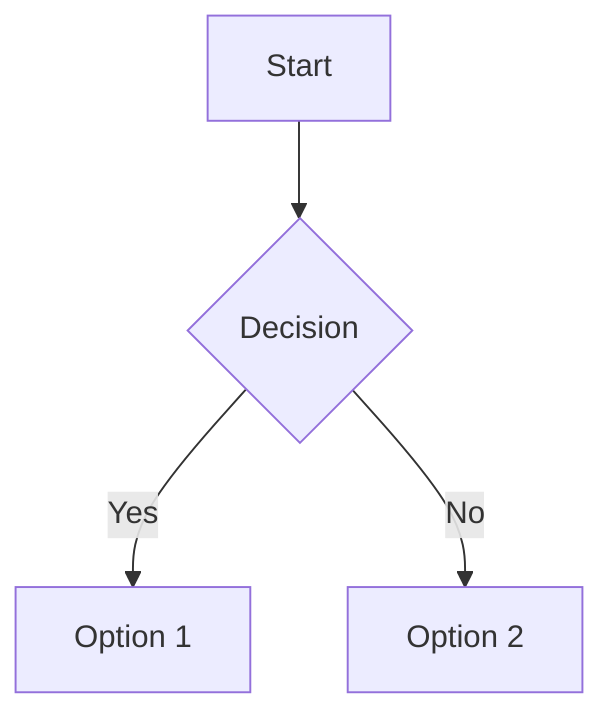

# Ariel - Mermaid Previewer

A single-page Blazor WebAssembly application for creating and previewing Mermaid diagrams in real-time.

## Features

- ✏️ **Live Markdown Editor** - Write Markdown with Mermaid code blocks
- 👁️ **Real-time Preview** - See diagrams render instantly as you type
- 🎨 **Dark/Light Theme** - Toggle between themes for comfortable viewing
- 💾 **Auto-save** - Your work is automatically saved to browser localStorage
- 📥 **Export** - Download diagrams as SVG or PNG files
- 📱 **Responsive** - Works on desktop and mobile devices
- 🚀 **Client-side Only** - No server required, fully offline capable

## Demo

Visit the live demo at: [https://netonia.github.io/Ariel/](https://netonia.github.io/Ariel/)

### Screenshots

**Dark Theme:**


**Light Theme:**


## Usage

1. Write or paste Markdown with Mermaid diagram code blocks in the left editor
2. See the rendered diagram appear in real-time on the right preview pane
3. Toggle between dark/light themes using the button in the header
4. Export diagrams as SVG or PNG using the export buttons
5. Your content is automatically saved to localStorage

### Example Markdown

```markdown
# My Flowchart


```

## Development

### Prerequisites

- .NET 9.0 SDK
- Node.js (for Mermaid.js dependency)

### Running Locally

1. Clone the repository
   ```bash
   git clone https://github.com/Netonia/Ariel.git
   cd Ariel
   ```

2. Install dependencies
   ```bash
   npm install
   dotnet restore
   ```

3. Run the application
   ```bash
   dotnet run
   ```

4. Open your browser to `http://localhost:5283`

### Building for Production

```bash
dotnet publish -c Release
```

The output will be in `bin/Release/net9.0/publish/wwwroot`

## Technology Stack

- **Frontend Framework**: Blazor WebAssembly (.NET 9)
- **Diagram Library**: Mermaid.js
- **Styling**: Custom CSS with CSS Variables for theming
- **Hosting**: GitHub Pages

## License

ISC

## Acknowledgments

- [Mermaid.js](https://mermaid.js.org/) - For the amazing diagram rendering library
- [Blazor](https://dotnet.microsoft.com/apps/aspnet/web-apps/blazor) - For the WebAssembly framework